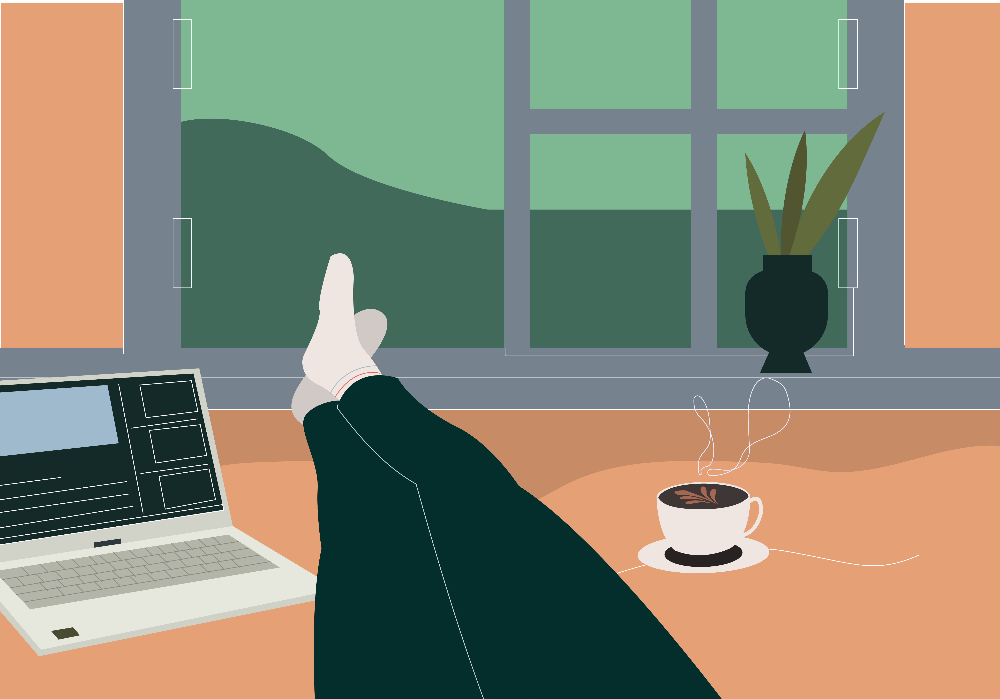
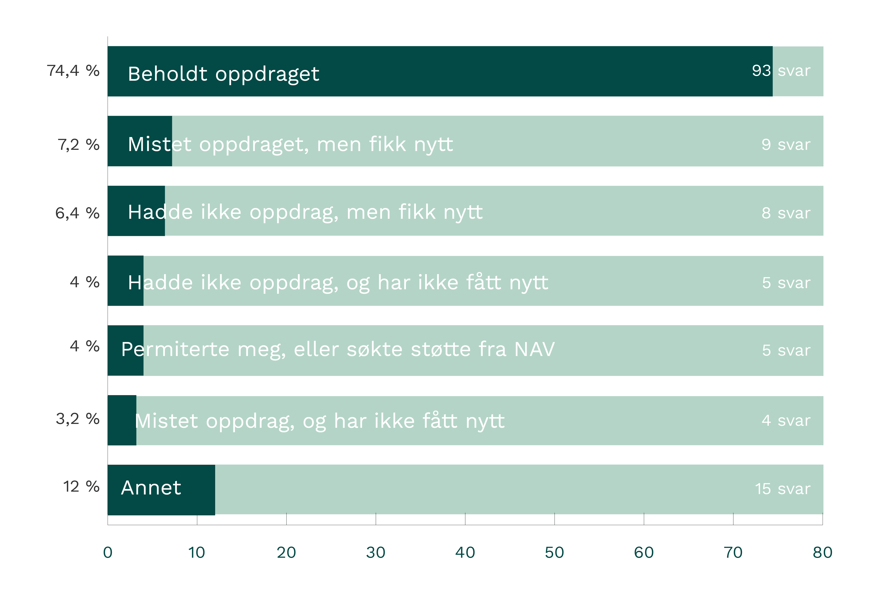
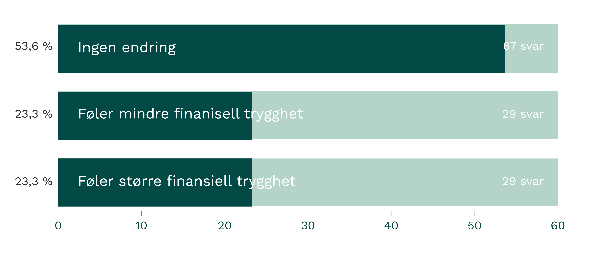
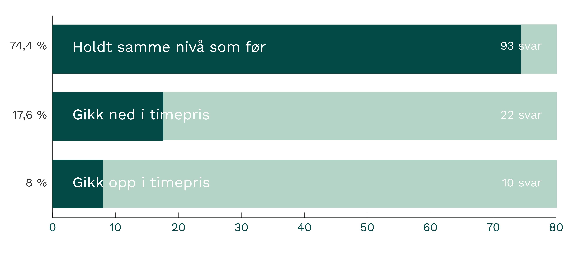

Da vi sendte ut undersøkelsen vår i august, var et av temaene vi tok opp hvordan det har vært å være selvstendig konsulent under korona. Her er lite glimt fra hvordan konsulentene i nettverket har opplevd de siste seks månedene.

###Oppdrag og prosjekter
De aller fleste har enten behold oppdraget eller fått et nytt de siste månedene.

Under annet finner vi svar som:

- Foreldrepermisjon
- Redusert stillingsprosent eller nedskalert prosjekt
- Ble selvstendig under korona
- Friår

###Finansiell trygghet

I løpet av de siste månedene, har vi hatt flere diskusjoner i Slack-kanalen vår om hvordan folk ser på finansiell sikkerhet. Vi tok derfor tempen på hvordan nettverket ser på sin egen finansielle trygghet, i forhold til før korona.

###Utvikling i timepris

Arbeidsmarkedet med oppdrag og prosjekter virket usikkert i vår, men det ser ikke ut til å ha påvirket timeprisen til konsulentene. Majoriteten holder samme nivå. Det vi ikke fikk svar på her er hvorfor timeprisen gikk ned eller opp. Det kan ha vært at den ble redusert i det oppdraget konsulenten allerede hadde, eller på grunn av ny oppdragsgiver og nye kontrakter.

###Hvordan er det å være selvstendig konsulent akkurat nå?

I de 118 fritekstsvarene vi fikk inn, uttrykker de fleste at de trives med tilværelsen. Flere trekker likevel frem utfordringer knyttet til arbeidsmiljø og oppdragsmengde.

17 % (20 respondenter) er helt negative til tilværelsen, og de sier at de opplever vanskeligere å finne oppdrag, større utrygghet knyttet til arbeidsmarkedet, usikkerhet med tanke på å finne nytt oppdrag og at det er litt ensomt på hjemmekontor i lengden.

*«Ikke de beste tid akkurat nå for å være selvstending. Stabilt/fast jobb kan være mer attraktiv for mange. Men, å tjene mer er spesielt viktig akkurat nå - for å skape trygghet.»*

*«Litt for mye hjemmekontor. Litt usikkerhet på oppdragsmengde fremover.»*

*«Litt stressende med usikker nasjonal økonomi og en bransje med flere ledige enn før.»*

I de andre svarene finner vi en balanse der folk syns det er litt vel mye hjemmekontor, men at de fremdeles ser positivt på fremtiden.

*«Største endring er å jobbe hjemmefra. Jobber mer effektivt når jeg jobber og liker mulighet til å kunne gjøre dette noen ganger. Men syns jobbingen blir mer intens, og savner å jobbe tett med team og kunne drøfte ting uten at man må ta det på skype.»*

*«Jeg startet opp akkurat når landet stengte. Hadde oppdrag mot bank som forduftet når de gikk i konservativt modus. Endte opp med å ta korttidsoppdrag med 40 % redusert timepris for å ikke gå ledig.Selv om det ble en veldig redusert økonomisk resultat av oppstarten er jeg godt fornøyd. Trives vesentlig bedre med dynamikken mellom konsulent og oppdragsgiver en jeg gjorde som ansatt ovenfor arbeidsgiver.»*

*«Jeg har på 3 år bygget opp et firma med et solid overskudd, og har dermed en stor finansiell trygghet dersom jeg skulle stå uten oppdrag en periode. Jeg trenger ikke være bekymret for å bli sagt opp eller permittert - for jeg er min egen sjef.»*

*«Har nå hatt 2 dager fri etter siste oppdrag, og er på jakt etter nytt. Litt skrekkblandet fryd etter å ha vært full-booket sammenhengende i 6 år, men bruker tiden på kompetanseheving. Ser lyst på fremtiden.»*

*«Deilig med frihet. Litt skummelt også fordi jeg tror at vi er de første som mister oppdrag hvis kunden nedbemanner fordi vi er små.»*

*«Litt brakkesyke da vi fortsatt har hjemmekontor, men er veldig positiv til veien videre!»*

Arbeidsmarkedet og arbeidslivet under korona endrer seg hele tiden. Akkurat nå ser vi også lyst på fremtiden, spesielt sett i lys av hvor mange oppdrag vi har fått inn på [brainbase.no](https://brainbase.no) den siste tiden.

En ting som er positivt, er at flere bedrifter har blitt nødt til å få fart på digitaliseringen og at det er større aksept for at folk jobber effektivt både remote eller på hjemmekontor. Vi håper at flere arbeidsgivere gir både faste ansatte og konsulenter rom til å jobbe fleksibelt, på en måte som passer de best. Noen trives mest med å være på kontoret hver dag, mens andre jobber best på hjemmekontor.
