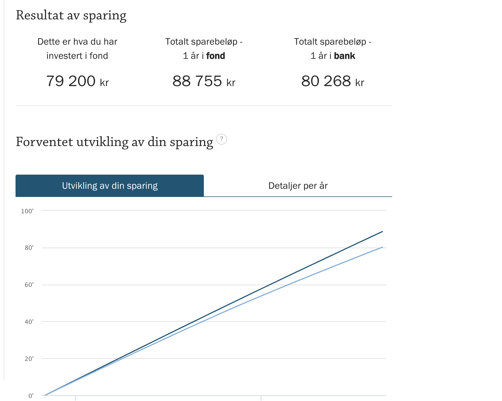

Vi har mange gode dialoger på vår Slack kanal. Noen ganger diskuteres ulike brokers også og i en slik anledning kom følgende kommentar fra et av medlemmene i nettverket:

> “men hva er egentlig forskjellen på Folq, Brainbase og Prodata – bortsett fra 7 %, 3 % og x % ?”

**Grunn nr 1: Det er mye penger å tjene på å velge et oppdrag hvor en gir fra seg 3% i stedet for 7 eller x%**

La oss se på et konkret eksempel:

En konsulent har fått tilbud om et oppdrag. På siden hvor modellen vår er beskrevet kan en se hvor mye en kan spare på å leie inn folk fra BrainBase. Men sett fra konsulentens side - hvor mye tjener en ved å velge en klassisk broker?  La oss anta brokeren tar 7%:

I regnestykket antar vi også følgende:

* 1200 i timepris (en gjennomsnittlig pris for medlemmer i nettverket vårt)
* 1650 fakturerte timer i løpet av året

Over 1 år vil mellomleddet i dette tilfellet ta:

1200 kr/time * 1600 timer * 7% = 138 600 NOK

Til sammenlikning ville BrainBase tatt:

	1200 * 1600 * 0.03 = 59 400 NOK

**Det vil si at  du sitter igjen med 79 200 kr ekstra per år ved å velge BrainBase**

## Hva kan en få for 80 000 kr?
80 000 kr er mye penger. Her er et forslag til hva du kan gjøre med pengene:

#### Regnskapstjenester, forsikring mm
	* Regnkapsfører i 1 år ( ca 40 000 kr)
	* Alle nødvendige forsikringer (ca 20 000 kr)
	* 20 000 kr til diverse lisenser osv, konferanser, videreutdanning eller liknende

### Eller hva med å plassere pengene i fond?
Så langt har 2022 vært et turbulent år i aksjemarkedet. I dag, 13.juni, er det blodrødt på børsene. Men historisk sett har investering i fond gitt god avkastning.
I 2021 var avkastningen på Oslo Børs på 23% (se diagrammet under).

Nå er det riktignok dobbelt så mye som i et normalår. Okke som, med et langsiktig perspektiv gir det historisk sett god gevinst å investere i fond. 
De fleste eksperter anbefaler at en investerer regelmessig, f.eks en gang i måneden, for å få med svingninger. Så la oss si at jeg i løpet av 2021 satte inn 79 200 kr i Nordnet Indeksfond Norge jevnt over de 12 månedene i året, altså 6 600 kr pr måned. 
Basert på avkastningen på Oslo Børs dette årete ville dette beløpet vokst til 88 755 kr.  

Noen syns kanskje det er greit å finansiere brokers med et stort salgsapparat, eller grådige eiere. I BrainBase gjør vi alltid det som er til det beste for oss konsulenter i nettverket. 
I en verden med galopperende inflasjon, og dermed stadig høyere priser, er det beste for konsulenten å sitte igjen med 80 000 kr ekstra i inntekter.   

I BrainBase har vi ikke et stort salgsapparat eller annet unødvendig byråkrati. I stedet hjelper vi hverandre med å søke på oppdrag. Når en konsulent har hjulpet en annen konsulent med å komme i oppdrag gjennom BrainBase, gir vi 1% av 3% cut’en til denne konsulenten. Dette, og flere andre måter vi hjelper hverandre på, skal vi se nærmere på i neste post. 
