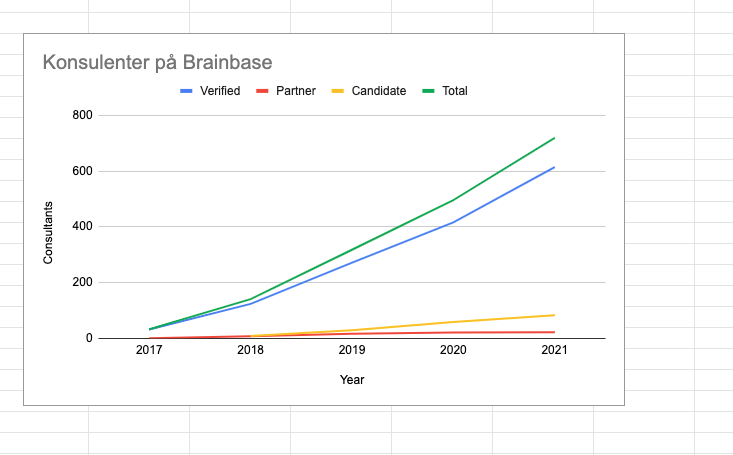

Vi er nå 2 uker inn i 2022. Det er derfor på sin plass og se litt tilbake på noen av de viktigste tingene som skjedde i 2021. Det har vært et begivenhetsrikt år der veksten til BrainBase har fortsatt. **Antall verifiserte konsulenter på plattformen økte med 45%** og vi har nå rundt 720 dyktige og erfarne konsulenter på plattformen. **Antall nye bedrifter som har registrert seg på plattformen er opp 100%** og teller nå ca 100 registrerte bedrifter. Vi opplevde også en sterk økning i avtaler mot offentlig sektor.

**Omsetning endte på ca 27 MNOK** for året. Av pengene som kom inn ble ca **250 000 kr betalt ut igjen til konsulenter** som har bidratt med å få andre konsulenter inn i oppdrag. Våre driftskostnader fortsetter å være lave og det ser ut til at vi lander på et positivt resultat for 3 år på rad. Med økt vekst har også arbeidsmengden økt. I 2021 fikk vi derfor vår første fast ansatte. **Ina Cervin startet i jobben som COO i BrainBase i mai 2021 og har har gjort en meget god jobb så langt!** Vi er veldig glad for å ha Ina med på laget!

I januar/februar fullførte vi også vår andre rettede emisjon i nettverket. Det var stor interesse og den ble overtegnet med 2.5 gangen. Med dette fikk vi **50 nye eiere og vi er nå totalt 63 eiere i BrainBase**. Vi ser dette som et sterkt signal om at folk liker det vi driver på med. I fremtiden håper vi å kunne gjennomføre flere slike emisjoner.

Mot slutten av året valgte vi også et nytt styre for BrainBase. Vi økte antall styreplasser fra 5 til 9 og fikk 4 nye medlemmer av styret: **Tatiana Lochekhina, Victoria Elkina, Jie Li og Michael Johansen er nye medlemmer av styret**. Vi tror dette blir veldig bra!

I det nye året vil vi **fortsette å utfordre de klassiske brokerne i konsulentmarkedet og bli et enda bedre alternativ for selvstendige konsulenter**. Vi ønsker å fortsette å være det beste commmunity'et og det foretrukne nettverket for selvstendige konsulenter. Det nye styret vil i løpet av januar komme opp med mer konkrete mål. 

### Update - 2 uker inn i det nye året
Veksten for BrainBase fortsetter og etter bare 2 uker av det nye året har vi:

* 11 nye verifserte konsulenter
* 5 konsulenter som vurderer å bli selvstendig
* 3 nye kunder registrert på plattformen
* Vunnet kontrakt med Mattilsynet.