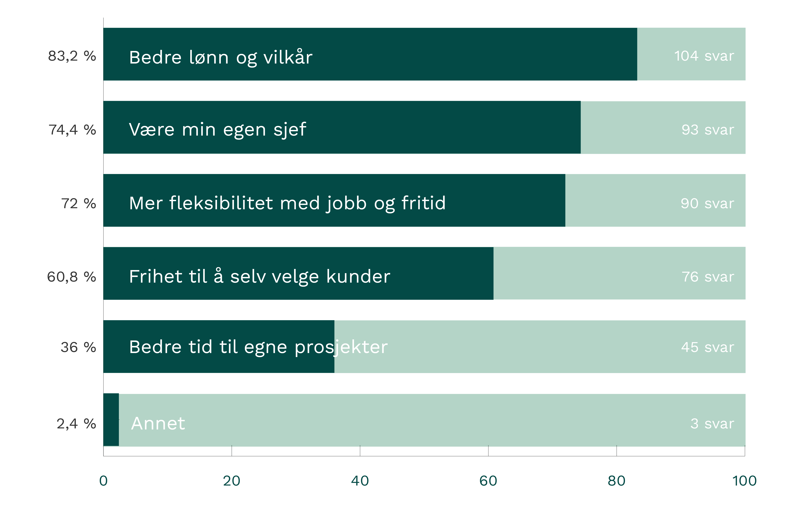
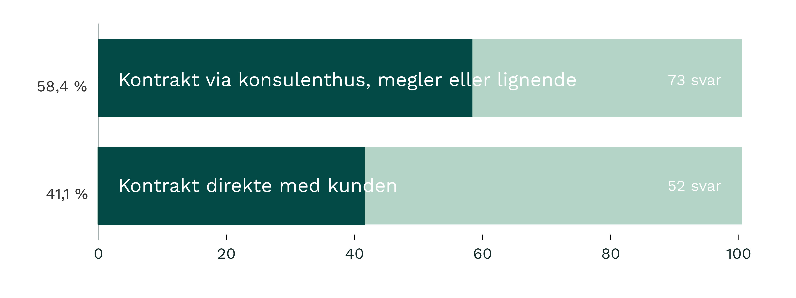
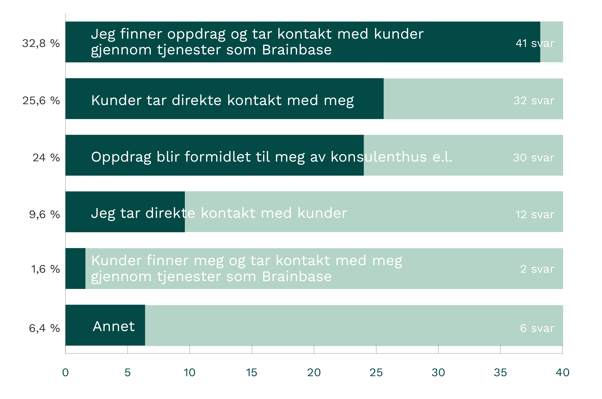
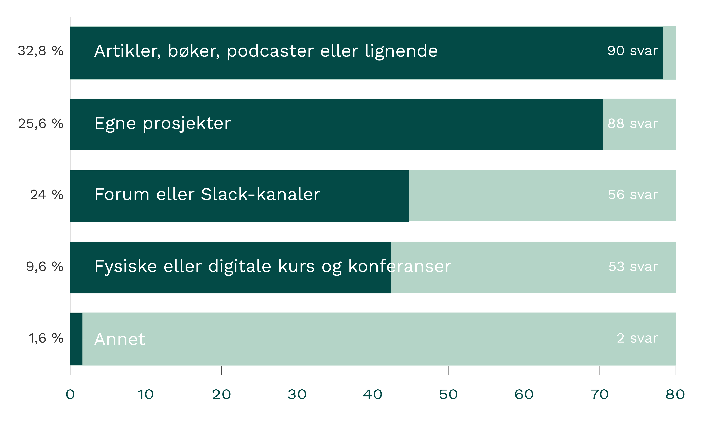
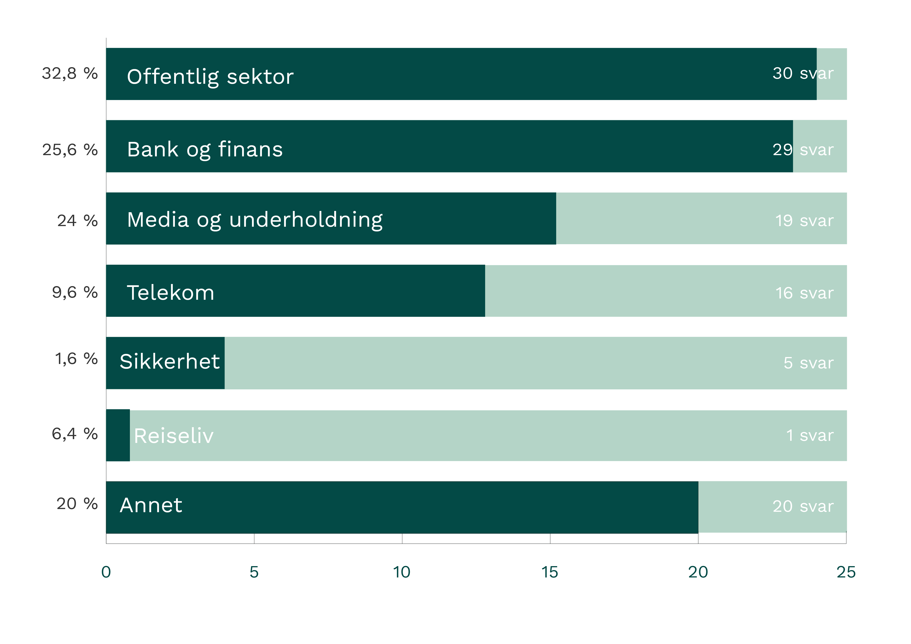
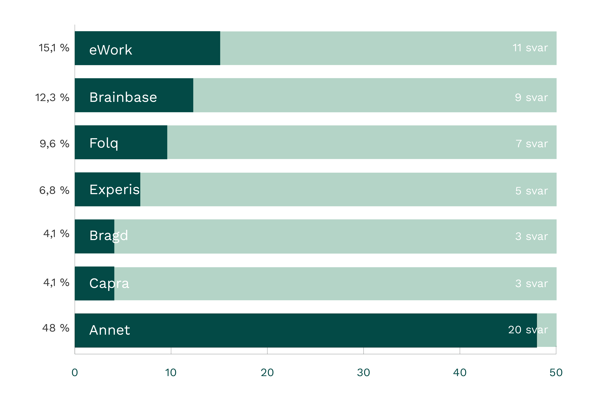
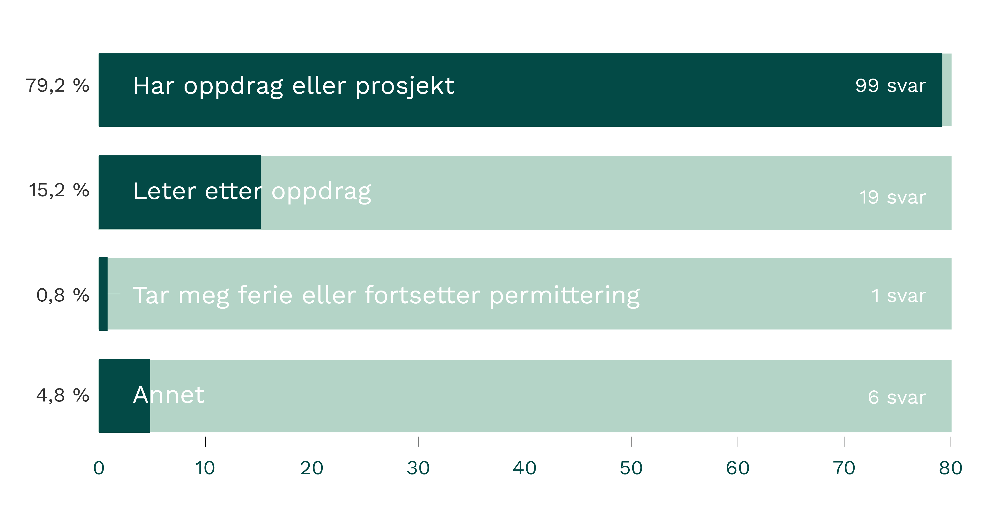

Det er to år siden vi gjennomførte forrige undersøkelse. Arbeidslivet har endret seg mye siden da, og spesielt det siste halve året. Samtidig ser vi at flere velger å bli selvstendige konsulenter. Vi var nysgjerrige på hvorfor folk vil jobbe for seg selv, og hvordan livet som selvstendig er akkurat nå.

###Innsamling og datagrunnlag

Vi sendte ut undersøkelsen internt i nettverket, på både e-post og på Slack. 125 personer svarte på undersøkelsen, omtrent 30 % av nettverket. De fleste som svarte på undersøkelsen jobber som utviklere, og dette gjenspeiler også balansen i nettverket. Vi sendte ut undersøkelsen i starten av august, den var åpen i en måned.

87,5 % av de som svarte på undersøkelsen jobber hovedsakelig med utvikling, mens 6,5 % jobber med design og innhold, og 6 % rådgivning og ledelse.

Alle spørsmål om rolle, erfaring og oppdrag var obligatoriske, mens fritekstspørsmålene om livet som konsulent var valgfritt å svare på.

###Kort oppsummert
Gjennomsnittskonsulenten i nettverket har **12 års arbeidserfaring**, og har **vært selvstendig i 2,8 år**. Konsulenten **jobber 38 timer i uken**, og bruker **10 timer i måneden på faglig utvikling**. I det nåværende prosjektet eller oppdraget har konsulenten en **timepris på 1170 kroner**.

###Livet som selvstendig konsulent
Vi lurte på hva som var gjorde at folk valgte å ta steget over til å bli selvstendig konsulent. Her var det mulig å krysse av flere alternativer.

Vi ba konsulentene beskrive med egne ord om hva de mener er fordelene med å være selvstendig. Selv om bedre lønn og det å være sin egen sjef ser ut til å være det viktigste for det å bli selvstendige, er det ordet som ble brukt flest ganger **frihet**. 58 de 113 som svarte på dette spørsmålet nevner det som en av de viktigste fordelene.

Svarene vi fikk var samstemte, og handler om;

- Større frihet
- Økt fleksibilitet
- Være sin egen sjef
- Bedre lønn
- Valgfrihet knyttet til prosjekter og oppdrag
- Relevant kompetanseheving
- Mindre byråkrati og møter

####Sagt med egne ord

Frihet til å velge prosjekter selv. Frihet til å disponere din tid selv. Slippe å betale for tjenester du ikke bruker som ansatt i konsulentselskap.

*«Frihet til å velge prosjekter, kunne gjøre andre ting i perioder, og tilpasse egen karriereutvikling og -verktøy.»*

*«Jeg går inn som meg - ikke som et selskap og jeg bryr meg ikke om verdier og slagord fra et konsulentselskap og ikke har jeg interesse av å rekruttere til der jeg jobber - jeg er 100% helt meg selv i person uten noen andre hensikter enn å gjøre en knall jobb! Føles som en frihet å bare være meg selv og ikke «hun fra selskap X» eller lignende.»*

*«Det er lettere å fokusere på å skape nytteverdi: Man er bare ansvarlig for skape verdi for kunden som betaler for arbeidet, og har ingen økonomiske eller tidsmessige krav fra et mellomledd. Tid brukt på kompetanseheving, sosiale/veldedige tjenester eller eget rekreasjonsbehov trenger ikke innarbeides igjen. Man sitter igjen med hoveddelen av verdien man skaper; og verdien skapes av arbeidet man gjør.»*

###Fordeler for bedrifter

Vi lurte også på hvilke fordeler konsulentene selv mener bedriftene får når de leier inn selvstendige. Fritekstsvarene kan oppsummeres til:

- Mer for pengene
- Økt engasjement og motivasjon
- Det man ser, er det man får
- Dedikerte konsulenter
- Enklere prosess

##Sagt med egne ord

*«De får en konsulent som er motivert av eget initiativ og ikke sendt ut av et selskap. De får en person som er tilstedet uten overhead fra konsulentskap som «ledersamtaler», sosiale eventer osv. De får en konsulent som er tilstede uten andre intensjoner enn å gjøre en bra jobb! De får en motivert person som selv har solgt seg inn fordi personen synes selskapet og oppdraget virker spennende. Du får en person du kan ha en direkte dialog med - ingenting via selger broker etc (hvis direkte eller via bb).»*

*«De får selvstendige og drevne personer som i større grad motiveres av å levere verdi da det er med å bygge deres eget brand.»*

*«Jeg har observert et tydelig skille i dedikasjon til jobben og kompetanse-nivå. Jeg jobber med et par andre selvstendige konsulenter nå og de er helt ekstremt dyktige. Noe jeg aldri tror de ville fått gjennom et konsulenthus ala Itera, Netlight, Accenture, som markedsfører seg primært mot nyutdannede (og tjener mest på de).»*

*«Kunder som leier inn selvstendige konsulenter, får fornøyde konsulenter som gjerne vil gjøre kundene fornøyde.»*

Andre mener at det ikke er så stor forskjell, og at det kommer an på person og ikke hvilken måte man er leid inn på.

«Dette er personavhengig, og har ikke nødvendigvis så mye med om du er via konsulenthus eller som selvstendig.»

*«Helt ærlig tror jeg ikke det er noen fordel. 99% koker ned til hvor flink konsulenten er uavhenging av tilhørlighet.»*

###Oppdrag og prosjekter

91 % av konsulentene som svarte på undersøkelsen har jobb nå, og for 77 % av disse er oppdragt tidsbestemt. Så, hvordan finner folk oppdrag og prosjekter som selvstendig konsulent?

####Kontrakter
Det er et lite flertall på 58,4 % som har kontrakt via konsulenthus, megler eller lignende, mens de resterende 41,4 % har kontrakt direkte med kunden.

####Mellomledd
Blant de 73 konsulentene som har kontrakt via ett mellomled eller megler, finner vi hele 30 forskjellige konsulenthus eller meglere! De tre største er eWork, Brainbase og Folq.

56 av de 73 som har kontrakt via konsulent eller lignende, sa at disse tar en del av kontraktsverdien. Enten som et påslag eller som ett kutt i timeprisen. Det spenner fra 2 % til 25 %, med et gjennomsnitt på 7,8 %.

####Bransjer

Under annet er det mange forskjellige bransjer, men de eneste med mer en én respondent er shipping, helse og IoT.

###Kompetanseheving og faglig utvikling

Nesten alle sier at de bruker tid på kompetanseheving i løpet av en måned. Det er kun to av respondentene, eller 1,6 %, som svarer at de ikke bruker noe tid på dette. Det spenner fra 2 timer til 20 timer, med et gjennomsnitt på 9,7 timer— altså litt over en arbeidsdag i måneden.

Hvordan folk bruker tid på å holde seg oppdatert faglig eller utvide kompetansen sin varierer, og her var det også mulig å krysse av for flere svar.

###Veien fremover

Som tidligere nevnt, hadde hele 91 % ett oppdrag når undersøkelsen ble sendt ut i august. Hvordan står det til utover høsten?

Under annet finner vi svar som går på at konsulent er usikker på kontrakten blir forlenget, har flere leads eller forholder seg til korte oppdrag.

I undersøkelsen spurte vi også om hvordan konsulentene har hatt det under korona, og hvordan de ser på økonomisk sikkerhet og fremtiden. Dette ser vi nærmere på i neste innlegg.